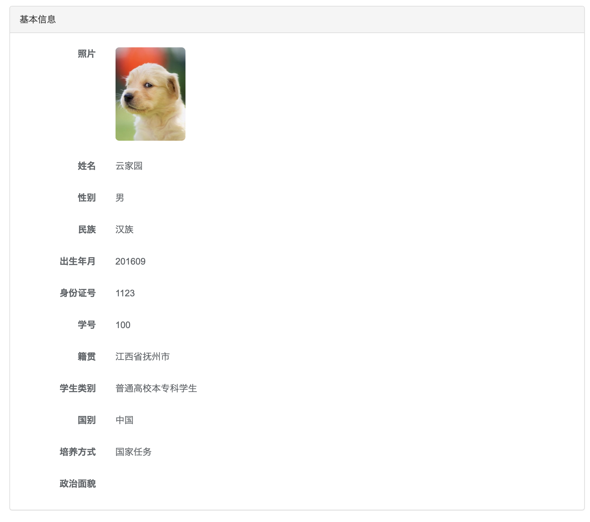

## 2018新生考核

#### 考核要求

###### 一. 模拟登录

**步骤**

- 请求云家园登录接口，输入真实的学号和密码（建议使用自己的账号）
- 登录成功，接口将返回一个token，请使用任意方法保存此token
- 使用此token请求个人资料接口，并渲染到页面上。效果大致如下：



**将用到的接口**

```
https://os.ncuos.com/api/user/token
https://os.ncuos.com/api/user/profile/basic
```

###### 二. 爬虫

- 爬取站点`https://blog.snowstar.org`（以下简称“此站点”）中所有文章的**标题**、**发布时间（格式：YYYY-MM-DD）**、**文章内容摘要**
- 找到此站点的搜索功能，爬取搜索结果，要求处理的数据种类同上
- 将上述两个爬虫编写成RESTFul API
- 编写前端页面，要求调用上一步的API，将此站点的文章显示在页面上（若有分页则自行编写分页功能）
- 编写搜索框，调用第三步的API，要求搜索某个关键词之后将结果输出至页面上。


> **注意：**
>
> - 搜索功能和展示功能的前端页面允许以不同的方式整合，例如：搜索框与展示区同在一个页面下，或将搜索功能编写在另一个独立页面中。
> - 此题后端语言不限，爬虫库不限；前端允许使用jQuery库，也允许使用JavaScript框架（Vue/Angular/React），允许使用Node.js+Webpack技术
> - 注意后端允许跨域访问的问题

#### 代码提交

- clone此仓库
- 新建并checkout一个新分支，分支名**为姓名全拼（例如：彭瀚林的全拼为penghanlin）**
- 将所有代码commit到这个分支中
- 交卷时，将此分支push到远程仓库
